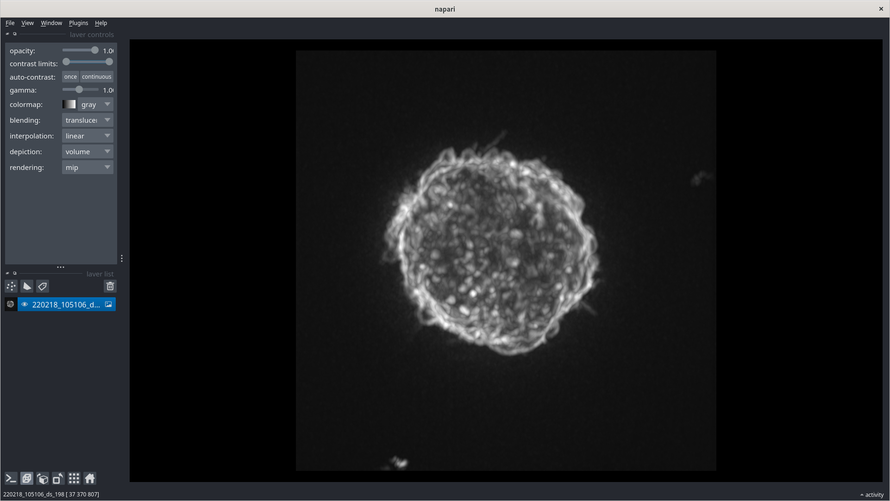
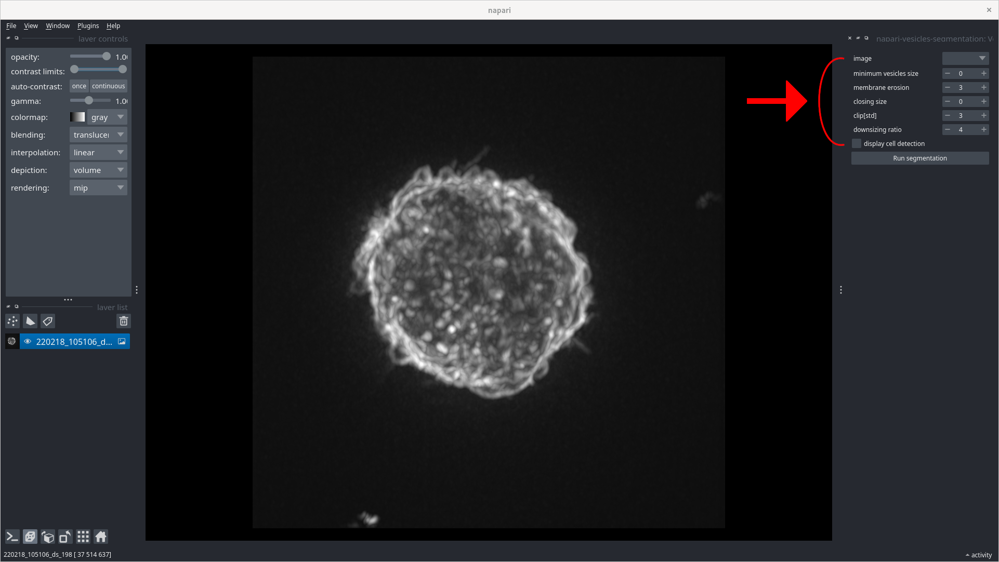
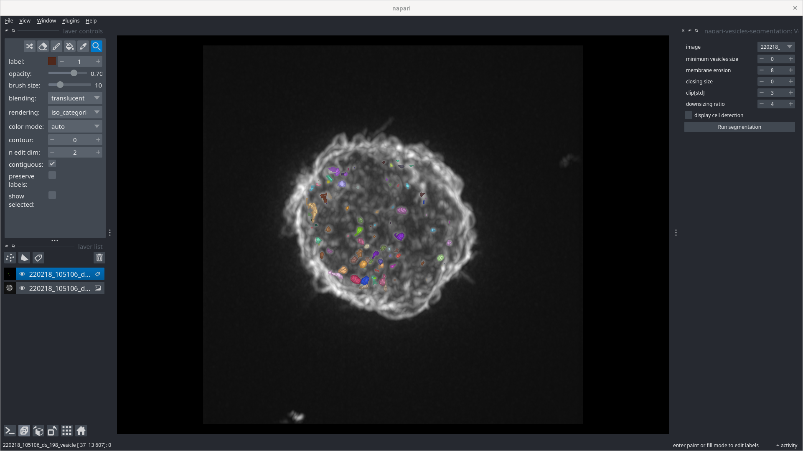

# napari-vesicles-segmentation

A simple plugin to detect vesicles in cells images.

----------------------------------

This [napari] plugin was generated with [Cookiecutter] using [@napari]'s [cookiecutter-napari-plugin] template.

<!--
Don't miss the full getting started guide to set up your new package:
https://github.com/napari/cookiecutter-napari-plugin#getting-started

and review the napari docs for plugin developers:
https://napari.org/plugins/index.html
-->

## Installation

You can install `napari-vesicles-segmentation` via [pip]:

    pip install napari-vesicles-segmentation

To install latest development version :

    pip install git+https://github.com/alexisjapas/napari-vesicles-segmentation.git

## Usage
1. Open napari
2. Open your data

3. Launch the vesicles-segmentation plugin
4. Select the data you want to segment and set the parameters of the segmentation

    * **image**: The image to segment vesicles in. The image can be a 2D or 3D temporal stack of images.
    * **minimum vesicles size**: The minimum size of the vesicles to detect. Smaller detected vesicles are removed.
    * **membrane erosion**: The size of the disk radius used for eroding the cell. This is used to remove the external membrane. This parameter scales when downsizing the image, for more information see 'downsizing ratio' parameter.
    * **closing size**: The size of the disk radius used for closing the cell. This is used to fill holes in the cell. This parameter scales when downsizing the image, for more information see 'downsizing ratio' parameter.
    * **clip**: If set to zero, no standardization is performed. Otherwise, the standard deviation of the image is set to n_sigma * the standard deviation of the image, the image is standardized and its values are clipped to the range [-1, 1] in order to remove outliers. The higher the value of n_sigma, the less outliers are removed. This operation can lead to a better detection of the cell.
    * **downsampling ratio**: The downsampling ratio used for the downsampled image. This is used to speed up the computation. Downsampling the image have impact in reducing the resolution of erosion and closing e.g. for a downsize ratio of 2, setting the erosion size to 3 will result in an erosion size of 6.
    * **display cell detection**: If set to True, the cell detection is displayed in the viewer instead of the vesicle detection.
5. Click on the "Segment" button to start the segmentation. This can take few seconds or minutes depending on the size of the data. The result is added to the viewer as below.

## Contributing

Contributions are very welcome. Tests can be run with [tox], please ensure
the coverage at least stays the same before you submit a pull request.

## License

Distributed under the terms of the [BSD-3] license,
"napari-vesicles-segmentation" is free and open source software

## Issues

If you encounter any problems, please [file an issue] along with a detailed description.

[napari]: https://github.com/napari/napari
[Cookiecutter]: https://github.com/audreyr/cookiecutter
[@napari]: https://github.com/napari
[MIT]: http://opensource.org/licenses/MIT
[BSD-3]: http://opensource.org/licenses/BSD-3-Clause
[GNU GPL v3.0]: http://www.gnu.org/licenses/gpl-3.0.txt
[GNU LGPL v3.0]: http://www.gnu.org/licenses/lgpl-3.0.txt
[Apache Software License 2.0]: http://www.apache.org/licenses/LICENSE-2.0
[Mozilla Public License 2.0]: https://www.mozilla.org/media/MPL/2.0/index.txt
[cookiecutter-napari-plugin]: https://github.com/napari/cookiecutter-napari-plugin

[file an issue]: https://github.com/alexisjapas/napari-vesicles-segmentation/issues

[napari]: https://github.com/napari/napari
[tox]: https://tox.readthedocs.io/en/latest/
[pip]: https://pypi.org/project/pip/
[PyPI]: https://pypi.org/
